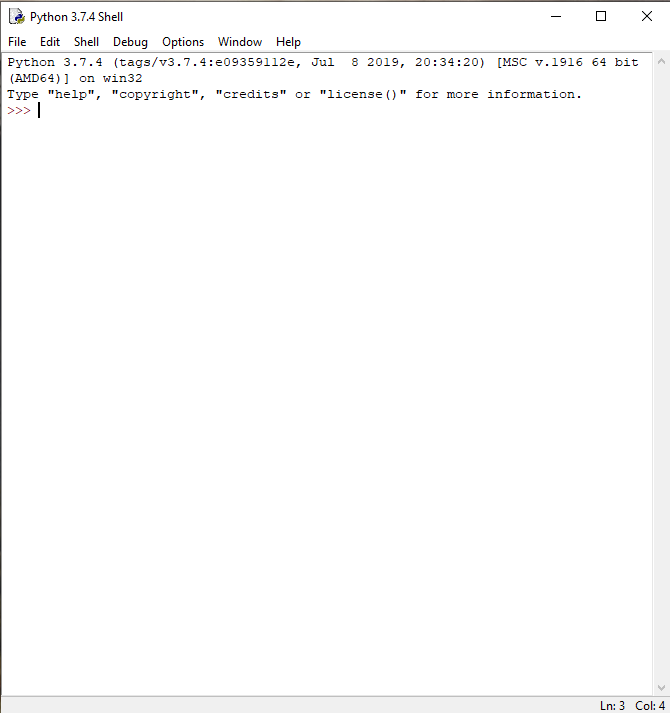

# Úvod do Pythonu

[Python](https://www.python.org/) je jeden z mnohých *programovacích jazykov*.
Tak ako ľudia medzi sebou sa rozprávame spoločným jazykom, potrebujeme sa
naučiť nový jazyk, ktorému rozumie počítač či robot. Tak mu budeme vedieť
povedať, kedy sa pohnúť, ako rýchlo, čo zobraziť na displeji, a podobne.

Poďme na to!

## Python ako kalkulačka

Spustíme program [IDLE](https://docs.python.org/3/library/idle.html). Otvorí sa
okno podobné tomu na obrázku nižšie.



Tento program nám bude slúžiť na písanie *zdrojového kódu* a jeho spustenie.
Zdrojový kód -- to sú príkazy, ktoré napíšeme počítaču. On si potom tento kód
prečíta riadok za riadkom a vykoná ich. Hovoríme tiež, že ich *interpretuje*. V
okne, ktoré sa nám otvorilo, môžeme zadávať jednotlivé príkazy. Na poslednom
riadku vidíme tzv. *prompt*: `>>>`. Označuje, že program je pripravený počúvať
na naše príkazy. Dokáže napr. fungovať ako kalkulačka, stačí hneď za prompt
napísať jednoduchý príklad a stlačiť `Enter`.

```python
>>> 40 + 2
42
>>> 30 - 5 * 8
-10
```

Znak `*` znamená násobenie. Vidíme, že Python pozná základné matematické
pravidlá, najprv vypočítal násobenie, až potom odčítanie. Ak by sme ho predsa
len chceli presvedčiť, aby najprv odčítal, použijeme zátvorky. Rovnako ako v
matematike. S tým rozdielom, že musíme použiť okrúhle zátvorky `()`, tie
ostatné (`[]{}`) majú pre Python iný význam a len by sme ho poplietli.

```python
>>> (30 - 5) * 8
200
```

Pozrime sa na delenie:

```python
>>> 40 / 5
8.0
>>> 40 // 5
8
>>> 40 / 7
5.714285714285714
>>> 40 // 7
5
```

V Pythone sa rozlišujú dva typy delenia:

1. `/` je klasické delenie ako ho poznáme,
2. `//` je *celočíselné delenie*. To znamená, že výsledkom je číslo, koľkokrát
   najviac sa zmestí deliteľ do delenca celý. `7 * 5 = 35`, všetko je ešte v
   poriadku, ale `7 * 6 = 42`, a to je už viac než 40, preto `40 // 7 = 5`.

   (Presnejšie, je to delenie `/` nasledované zaokrúhlením nadol)

Ukážeme si ešte dve matematické špeciality.

### Modulo

Alebo inak: zvyšok po celočíselnom delení. Je to tá časť, ktorá nám ešte chýba,
keď použijeme celočíselné delenie `//` namiesto `/`. Pre túto operáciu sa používa znak
`%`.

```python
>>> 40 % 7
5
>>> 40 % 5
0
>>> 40 // 7 * 7 + 40 % 7
40
```

- - -
**Úloha**

Prečo posledný príklad vyšiel práve 40? Fungovalo by to aj s inými číslami?
Napr. s trojkou:
 
```python
>>> 3 // 7 * 7 + 3 % 7
```
 
Bude výsledok 3? Platí to pre všetky čísla?
- - -

Na poslednom príklade sa vám možno nepozdáva, že sme nepoužli žiadne zátvorky.
Nemuseli sme, lebo násobenie, delenie aj modulo majú rovnakú *prioritu*.
Sčítanie a odčítanie majú od nich menšiu prioritu, takže sa vyhodnotia neskôr.
To už vieme, keď sme toto správanie zmenili použitím zátvoriek. No a pri
viacerých operáciach rovnakej priority za sebou, Python ich vyhodnocuje zľava
doprava. Znovu ako v matematike.

Takže tento príklad sa interpretuje akoby bol uzátvorkovaný takto:

```python
>>> ((40 // 7) * 7) + (40 % 7)
40
```

### Mocnina

Pripomeňme si, že mocnina je opakované násobenie.  
2<sup>3</sup> = 2 * 2 * 2 = 8

V Pythone používame na umocňovanie operátor `**`:

```python
>>> 2 ** 3
8
>>> 4 ** 1
4
>>> 1 ** 1000000000
1
>>> 5 ** 0
1
```

Umocňovanie má ešte väčšiu prioritu než násobenie.

```python
>>> 4 * 2 ** 3
32
>>> (4 * 2) ** 3
512
```

- - -
**Úloha**

Aký je výsledok nasledujúcich matematických výrazov? Overte si správnu odpoveď
využitím Python IDLE.

* `- 5 + 8`
* `- (5 + 8)`
* `2 % 4 - 1`
* `10 // 3 ** 2`
* `5 / -3`
* `5 // -3 * 3 + 5 % -3`
- - -

### Premenné

Pri zložitejších výpočtoch si často chceme uložiť medzivýsledok. Moderné
kalkulačky to zvládnu a Python IDLE tiež!

```python
>>> x = 4 + 8
>>> x
12
>>> 2 * x
24
```

Príkaz `x = 4 + 8` znamená priradenie hodnoty na pravej strane (`4 + 8`) do
*premennej* na ľavej strane (`x`). Najprv Python vypočíta `4 + 8`. Potom si na
miesto v pamäti, kde má uložený výsledok, nalepí poznámku "x". Je to názov
novej premennej, aby si pamätal kam sa má pozrieť, keď ju uvidí v našich
príkazoch nabudúce.  Napr. `2 * x` -> `2 * 12` -> `24`.


Názvy môžu byť aj viacpísmenkové, môžu obsahovať veľké aj malé znaky, tiež
cifry (ale cifra nemôže stáť na začiatku mena) a podtržítko ("\_").

Čo sa stane ak budeme chcieť ukázať hodnotu premennej, ktorú Python ešte
nepozná?

```python
>>> y
Traceback (most recent call last):
  File "<stdin>", line 1, in <module>
NameError: name 'y' is not defined
```

Všimnime si posledný riadok. Hovorí nám, že názov "y" nie je definovaný, inými
slovami, nepozná ho, nevie kam sa pozrieť.

- - -
**Úloha**

Čo je výsledkom nasledujúcej postupnosti príkazov?

```python
>>> a = 3
>>> b = 2
>>> a = a + b
>>> b = a - b
>>> a = a - b
>>> a
?
>>> b
?
```
- - -

Aby sme si skratili zápis, namiesto

```python
>>> a = a + b
```

môžme používať

```python
>>> a += b
```

Význam je ten istý. Rovnako existuje `-=`, `*=`, `/=`, `//=`, `%=`, `**=`.
Vyskúšajte si použiť niektoré z nich.

## Tlačiť!

V tejto časti si ukážeme nový príkaz. Volá sa "print". Z angličtiny vieme
odhadnúť, na čo bude slúžiť. Vypíše text na obrazovku. Zatiaľ sme pracovali len
s číslami, ešte nie z textom. V Pythone sa text píše medzi úvodzovky (").
Pozor, ak napíšeme text bez úvodzoviek, interpretuje sa to ako názov, ktorý
bude Python hľadať a pravdepodobne dostaneme podobnú sťažnosť ako naposledy
(hovorí sa im *chybové hlášky*).

```python
>>> print( "Ahoj" )
Ahoj
>>> print( Ahoj )
Traceback (most recent call last):
  File "<stdin>", line 1, in <module>
NameError: name 'Ahoj' is not defined
```

Namiesto dvojitých úvodzoviek sa dajú použiť aj jednoduché (').

```python
>>> print( 'Cau' )
Cau
```

Text síce nie je číslo, ale v Pythone dokážeme text sčítavať a dokonca aj
násobiť!

```python
>>> print( 'Ahoj ' + 'Robo' + 'Lab' )
Ahoj RoboLab
>>> print( 'tra' + 'la' * 3 )
tralalala
>>> print( 3 + ' jablka' )
Traceback (most recent call last):
  File "<stdin>", line 1, in <module>
TypeError: unsupported operand type(s) for +: 'int' and 'str'
```

Sčítať text a číslo sa už nedá. To presne nám povie chybová hláška na poslednom
riadku: operátor `+` nefunguje s číslom (ang. **int**eger) a textom (ang.
character **str**ing). Ak potrebujeme vypísať v jednom príkaze text a zároveň
aj číslo, môžme ich oddeliť čiarkou. Python medzi ne automaticky vloží medzeru.

```python
>>> pocet = 3
>>> print( pocet )
3
>>> print( 'Mam', pocet, 'jablka' )
Mam 3 jablka
```

Takže `print` funguje aj s číslami, nielen textom! Pozor, môže sa zdať, že
nasledujúce riadky spravia to isté, ale nie je to celkom tak. Za chvíľu si o
tom povieme viac.

```python
>>> 3
3
>>> print( 3 )
3
```

## Náš prvý program

Python IDLE obsahuje dve časti. Jednu z nich, *príkazový riadok* (tiež
*shell*), sme používali doteraz. Slúži na vykonávanie jednotlivých príkazov,
ale naše programy v budúcnosti budú omnoho dlhšie, pozostávajúc z niekoľko
desiatok, aj stoviek riadkov. Tu nám pomôže druhá časť: *editor*. Otvoríme ho
cez "File" -> "New". Napíšme doň náš prvý program:

```python
print( 'Ahoj', 'RoboLab' )
print( 'RoboLab zdravi' )
```

Používame to, čo sme sa už naučili, ale tentokrát nepíšeme naše príkazy do
príkazového riadku a nevykonajú sa hneď. Keď chceme spustiť program, stlačíme
kláves "F5". IDLE nás vyzve aby sme si program uložili a potom ho spustí v okne
príkazového riadku. Mali by sme zbadať vypísané:

```text
Ahoj RoboLab
RoboLab zdravi
```

Vráťme sa teraz k problému vypisovania čísel. Keď spustíme jednoduchý program,

```python
print( 3 * 5 )
```

na výstupe sa nám zobrazí `15`. Skúste si to! Správne, Python najprv vypočíta
"3 * 5 = 15" a následne výsledok príkazom `print` vypíše na obrazovku. Skúsme
teraz spustiť program bez príkazu `print`.

```python
3 * 5
```

Na výstupe sa nám nič nezobrazí! Prečo? Python znovu vyhodnotí "3 * 5 = 15",
ale tento **výsledok** sa stratí, nemá žiadny príkaz, aby ho vypísal.
Príkazový riadok nám vždy aj ukáže **výsledok** toho, čo mu zadáme.

```python
>>> 3 * 5
15
```

Ale ak chceme niečo vypísať z **programu**, vždy musíme použiť príkaz `print`!

(V ukážkach na týchto stránkach odlíšime príkazový riadok jednoducho:
začína tromi väčšítkami `>>>`. Ak tam nie sú, znamená to, že daná ukážka je
**program**, a teda ho treba napísať do editoru.)

## Prečo si to nezopakovať?

Doteraz bol Python celkom nudný. Keď sme chceli, aby nám niečo napísal, museli
sme mu to sami napísať a ešte k tomu naviac dopísať "print". Na čo nám je taký
Python? Ukážme si teda, že je silnejší, než sa zdá. Spustite si tento program.
Predposledné dva riadky začínajú štyrmi medzerami a namiesto štyroch stlačení
medzerníka môžeme použiť kláves "tabulátor".

```python
i = 0
while i < 3:
    print( 'tra' + 'la' * i )
    i += 1
print( 'koniec' )
```

Zdá sa, že sme použili nový príkaz: `while`. Aby sme mu porozumeli, musíme si
najprv povedať niečo o ne/pravdách v Pythone.

### Logické áno a nie

Presuňme sa nachvíľu znovu do príkazového riadku. Pracovali sme už s textovými
a číselnými hodnotami, teraz si ukážeme logické hodnoty (ang. *boolean* podľa
matematika [Georgea Boolea](https://sk.wikipedia.org/wiki/George_Boole)).
Existujú len dve: `True` (pravda) a `False` (nepravda). V počítačoch je všetko
jasné, buď to je jednoducho pravdivé alebo nie je.

```python
>>> 1 < 2
True
>>> 3 < -5
False
>>> 2 == 2
True
>>> 2 >= 1
True
>>> 2 >= 2
True
```

Máme celkovo 6 *porovnávacích operátorov*:

Operátor | Význam
:-------:|:------
`==`     | rovná sa
`!=`     | nerovná sa
`<`      | menšie než
`<=`     | menšie, nanajvýš rovné
`>`      | väčšie než
`>=`     | väčšie, nanajvýš rovné

**POZOR:** Ak chceme porovnávať, používame `==` (dva znaky "="), ale ak
priraďujeme hodnotu do premennej, používame len `=` (jeden znak "=").

```python
>>> a = 1
>>> a == 1
True
```

Porovnávať nemusíme len čísla:

```python
>>> 'text' != 'text'
False
>>> 2 == 'text'
False
>>> 2 == '2'
False
>>> 2 < 'text'
Traceback (most recent call last):
  File "<stdin>", line 1, in <module>
TypeError: '<' not supported between instances of 'int' and 'str'
>>> 'text' < 'text'
False
>>> 'a' < 'b'
True
>>> 'a' < 'aa'
True
>>> 'ab' <= 'aa'
False
```

Textové reťazce sa porovnávajú *lexikograficky*. To znamená, ak nejaké slovo
nájdeme v abecednom zozname skôr než nejaké druhé slovo, tak to prvé bude
menšie. Číslo sa nikdy nebude rovnať žiadnemu textu a dokonca na menšie/vačšie
sa ani nemôžeme spýtať.

```python
>>> False == False
True
>>> False == 0
True
>>> True == 1
True
>>> False < True
True
```

Logické hodnoty sa správajú ako čísla, pričom `False` je nula a `True`
jednotka.

```python
>>> True + True
2
>>> True * False
0
```

- - -
V Pythone má každá premenná (a každá hodnota) nejaký typ (*dátový typ*).
Dokážeme ho zistiť pomocou príkazu `type`:

```python
>>> type( 3 )
<class 'int'>
>>> type( 'text' )
<class 'str'>
>>> type( True )
<class 'bool'>
>>> a = False
>>> type( a )
<class 'bool'>
```

S presným významom slovíčka `class` si zatiaľ nebudeme lámať hlavu, stačí si
zapamätať, že každá hodnota má nejaký jednoznačný typ.
- - -

### Príkaz `while`

Teraz už budeme vedieť použiť príkaz `while` (nazýva sa tiež *cyklus*):

```python
while "podmienka":
    "príkaz 1"
    "príkaz 2"
    ...
"príkaz 3"
...
```

"while" znamená po anglicky "pokým". A tak mu Python aj rozumie. Pokým je
"podmienka" pravdivá, teda `True`, tak bude postupne vykonávať "príkaz 1",
"príkaz 2", ..., všetko, čo je odsadené o štyri medzery vpravo (týmto príkazom
hovoríme *telo cyklu*). Keď príde na koniec, znovu sa spýta, či je "podmienka"
pravdivá, ak áno, vykoná znovu telo cyklu. A tak stále dokola. Keď už
"podmienka" pravdivá nebude, Python skočí na "príkaz 3" a pokračuje ďalej.

Vyskúšajme si spraviť nekonečný cyklus. Napíšeme takýto jednoduchý program:

```python
while 1 == 1:
    print( 'ahoj' )
```

Spustíme, a keďže `1 == 1` sa vždy vyhodnotí na `True`, tak máme celú obrazovku
"ahoj"ov. Program môžme zastaviť klávesovou kombináciou Ctrl+C. Rovnako by sme
mohli napísať:

```python
while True:
    print( 'ahoj' )
```

- - -
**Úloha**

Čo vypíše nasledujúci program?

```python
while False:
    print( 'ahoj' )
print( 'koniec' )
```

Najprv skúste na to prísť sami, odpoveď si potom overte spustením.
- - -

Vieme už dosť na to, aby sme si napísali trochu zaujímavejší program. Budeme
"kresliť" trojuholníky z hviezdičiek (\*). Od teraz budeme písať zdrojový kód
po anglicky. Nebudú sa nám miešať slovenské a anglické slová (napr.
`print( 'jablko' )`), a keď vytvoríme nejaký úžasný program, budeme sa môcť oň
podeliť s celým svetom!

Ako chceme aby vyzerali trojuholníky z hviezdičiek? Najmenší trojuholník
veľkosti 1 je jednoduchý:

```text
*
```

Veľkosť dva:

```text
**
*
```

Veľkosť 4:

```text
****
***
**
*
```

Už máme predstavu, čo chceme naprogramovať, takže pustime sa do toho.
Potrebujeme vedieť, aký veľký trojuholník chceme.

```python
size = 3
```

Vidíme, že trojuholník je nakreslený na toľko isto riadkov aká je jeho veľkosť.

```python
size = 3

while size > 0:
    # print one row
    size -= 1
```

Na miesto `# print one row` napíšeme kód, ktorý to vykoná, zatiaľ sme si to len
poznačili. Takáto časť v zdrojovom kóde sa nazýva *komentár*. Začína sa znakom
"#" a pokračuje až do konca riadku. Komentáre Python ignoruje, sú to poznámky
nás, programátorov. Ak by sme úvodný "#" nepoužili, Python by sa snažil
interpretovať daný riadok ako príkaz a skončil by s chybovou hláškou.

Pozrime sa na to, ako sme použili premennú "size" v podmienke cyklu. Na
začiatku programu sa nastaví na hodnotu 3. Podmienka `size > 0` sa vyhodnotí na
`True` a telo cyklu sa vykoná. V ňom máme príkaz `size -= 1`. Takže teraz už
platí "size = 2". Znovu príde na podmienku cyklu, "2 > 0", a teda telo cyklu sa
vykoná, "size" sa zníži o jedna, na hodnotu 1. Podmienka je znovu vyhodnotená
ako `True`, "size" sa zníži na hodnotu 0. Teraz už podmienka splnená nie je a
telo cyklu sa nezopakuje.

Celkovo sa teda cyklus zopakoval 3 krát. Presne to sme chceli! Zostáva nám v
každom opakovaní vykresliť jeden riadok. Na prvom riadku chceme mať 3
hviezdičky. Na druhom 2 a na poslednom jednu.

```python
size = 3

while size > 0:
    print( '*' * size )
    size -= 1
```

Hurá a je to! Teraz stačí zmeniť v prvom riadku "size" na veľkosť akú chceme a
Python nám vykreslí žiadaný trojuholník. Vyskúšajte si rôzne veľkosti.

- - -
**Úloha 1.**

Napíšte program podobný tomu poslednému, ktorý bude kresliť štvorce.

**Úloha 2.**

Napíšte program kresliaci trojuholníky, ale naopak ako doteraz. Teda, pre
veľkosť 4 bude vyzerať:

```text
*
**
***
****
```

Toto je už trochu ťažšia úloha, vyžaduje použiť až dve premenné. "size" sa
tentokrát meniť nebude, ale druhá premenná bude mať postupne hodnoty od 1 až po
"size", takže budete vedieť jednoducho vykresliť hviezdičky na každom riadku
podľa nej. Premyslite si to dobre.

**Úloha 3.**

Napíšte program, ktorý vykreslí obdĺžnik. Na začiatku budú teda dve premenné:
jedna pre veľkosť každej strany.

**Úloha 4.**

Pozor, toto je veľmi tvrdý oriešok! Napíšte program, tentokrát kresliaci
pyramídu. Tu sú vzory pre veľkosti 1, 2 a 4:

```text
*
```

```text
 *
***
```

```text
   *
  ***
 *****
*******
```
- - -
