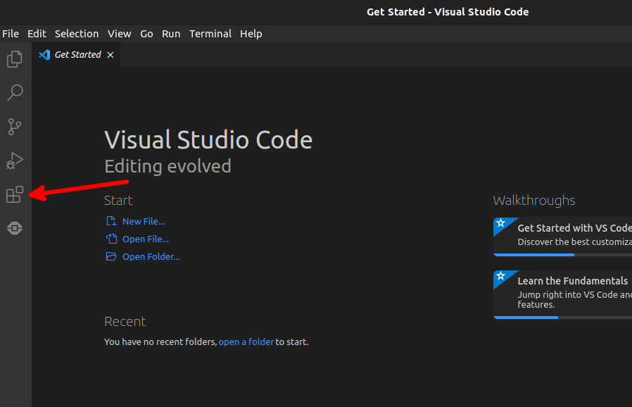
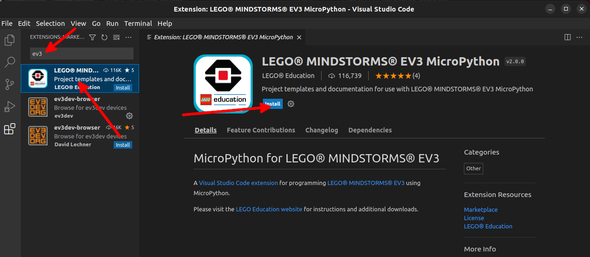
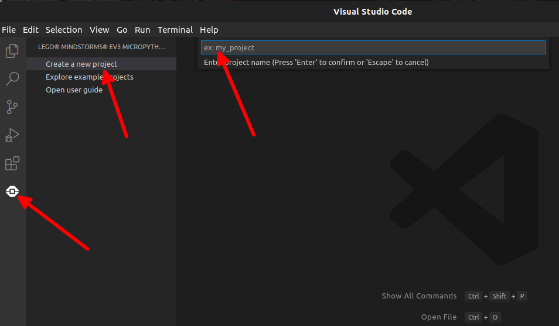
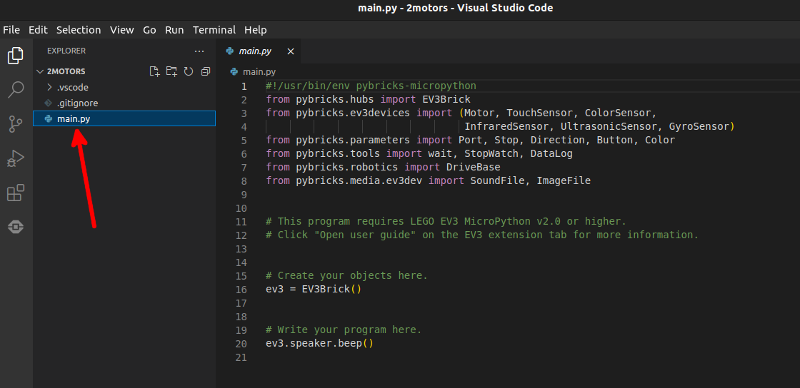
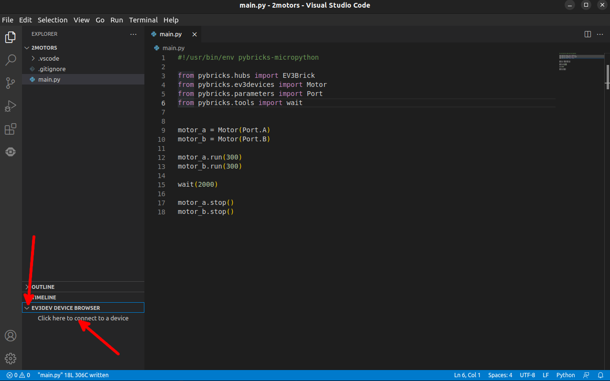
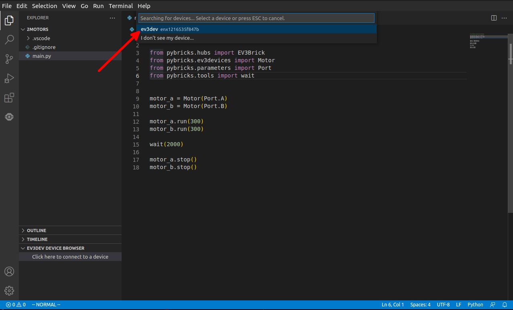
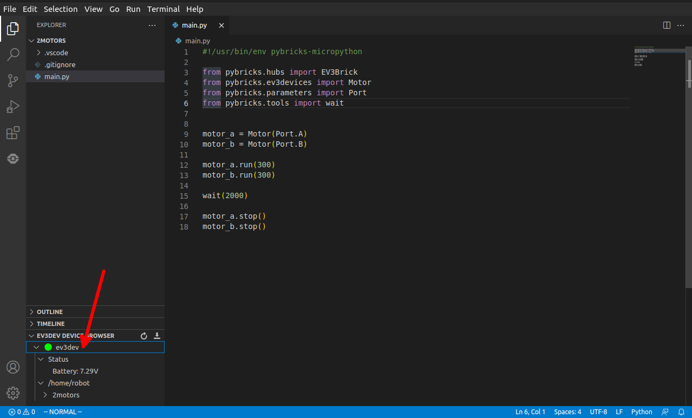
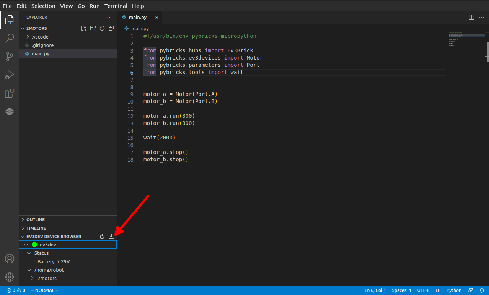
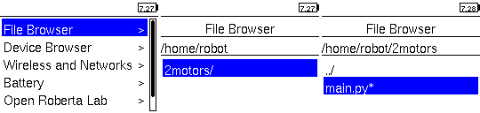

# Prvý robot

Dnes si postavíme a naprogramujeme našeho prvého LEGO robota! Bude mať dva
motory aby sa vedel pohybovať a *EV3-kocku* (*EV3 brick*), ktorá je takým mozgom
celého robota, bude riadiť motory, ktoré pripojíme do nej káblami. Káble by sme
mohli prirovnať k nervom a žilám v človeku. EV3-kocka je zároveň aj srdcom --
v zadnej časti obsahuje batérie, bez ktorých by mozog ani nohy (motory)
nemohli fungovať. Návod ako robota postaviť nájdete [tu](https://education.lego.com/v3/assets/blt293eea581807678a/bltc8481dd2666822ff/5f8801e3f4f4cf0fa39d2fef/ev3-rem-driving-base.pdf).


## Príprava EV3-kocky

Programy budeme stále písať na počítači a potom ich cez USB kábel nahráme do
kocky. Aby EV3-kocka vedela spustiť Python, musíme jej trochu pomôcť. Na micro
SD kartu nahráme špeciálny operačný systém [ev3dev](https://www.ev3dev.org/).
Keď bude SD karta v EV3-kocke a zapneme ju, spustí sa `ev3dev`. Ak sa chceme
dostať do pôvodného režimu, jednoducho vypneme kocku, vytiahneme SD kartu
a znovu spustíme robota.

!!! tip "Tip"
    Návod na prípravu SD karty nájdete na
    [stránkach ev3dev](https://www.ev3dev.org/docs/getting-started/),
    kroky 1, 2 a 4.

## Príprava počítaču

Keďže EV3-kocka je omnoho jednoduchšie zariadenie než bežný počítač, nebudeme
na nej spúšťať skutočný Python, ale jeho jednoduchšiu verziu:
[MicroPython](https://micropython.org/) špeciálne upravený pre LEGO, nazýva sa
[Pybricks](https://pybricks.com/). Tak budeme môcť z Pythonu spúšťať LEGO
motory, vykreslovať obrázky na displeji, či načítavať dáta z rôznych senzorov.
Aby sme tieto programy vedeli spustiť na EV3-kocke, potrebujeme vykonať ešte
niekoľko vecí:

1. Nainštalovať si [Visual Studio Code](https://code.visualstudio.com/Download)
2. Spustiť ho
3. Otvoriť *extension tab*
   
4. Vyhľadať rozšírenie *EV3 MicroPython* a nainštalovať ho
   

Tak a máme všetko pripravené :)

## Vpred!

Teraz si napíšeme prvý jednoduchý program, ktorý pohne robota o kúsok vpred.

1. Vo *Visual Studio Code* si vytvoríme nový projekt.
   
2. Zadáme názov, napr. "2motors", a stlačíme ++enter++.
3. Otvorí sa nám prehliadač súborov. Tu zvolíme priečinok, kde chceme náš
   projekt mať uložený.
4. Dostaneme bezpečnostné upozornenie, či veríme autorom súborov vo zvolenom
   priečinku. Za predpokladu, že všetky budeme písať my, potvrdíme, že áno
5. Vo zvolenom priečinku sa nám vytvoril nový projektový priečinok s názvom
   aký sme zvolili v kroku 2 ("2motors"). Ten obsahuje súbor `main.py` s kódom, ktorý sa
   bude na robotovi spúšťať.
   
6. Vymažme počiatočný vygenerovaný kód v `main.py`
   a skopírujme doň tento:
   ```py linenums="1"
   #!/usr/bin/env pybricks-micropython
   
   from pybricks.ev3devices import Motor
   from pybricks.parameters import Port
   from pybricks.tools import wait
   
   
   left_motor = Motor( Port.B )
   right_motor = Motor( Port.C )

   left_motor.run( 360 )
   right_motor.run( 360 )

   wait( 2000 )

   left_motor.stop()
   right_motor.stop()
   ```
   Vyzerá trochu inak ako tie, čo sme písali doteraz. Zatiaľ sa tým netrápme,
   onedlho si všetko rýchlo vysvetlíme.
7. Teraz zapneme EV3-kocku (s SD kartou s nahratým `ev3dev`), prípojíme ju USB
   káblom k počítaču a pripojíme sa ku nej z *Visual Studio Code*.
   
8. Zvolíme našu EV3-kocku.
   
9. Vľavo dole by sme mali vidieť najprv žltý krúžok (EV3-kocka sa pripája),
   potom zelený, indikujúci úspešné pripojenie. Ak je červený, spojenie zlyhalo.
   Klik pravým -> "Reconnect" pre nový pokus.
   
   Ak sa pripojiť nedarí a používate Ubuntu, môže pomôcť nastaviť
   "IPv4 Method" na "Shared to other computers" vrámci nastavení siete
   "USB Ethernet".
10. Teraz nahráme program do EV3-kocky pomocou tlačidla vpravo od
    "EV3DEV DEVICE BROWSER" (vľavo dole).
   
11. Aby sme program spustili, musíme ho nájsť an EV3-kocke. Zvolíme (stredným
    tlačidlom) `File Browser` -> `2motors` -> `main.py`.
   
12. Po spustení sa motory na 2 sekundy rozbehnú a potom zastavia. To je všetko,
    čo náš program teraz robí. Celý tento postup nahrania kódu do EV3-kocky
    a spustenie ho sa dá spraviť naraz pomocou klávesu ++f5++, skúste si to.

## Vysvetlenie kódu

Prejdime si teraz náš program postupne, riadok po riadku:

```py linenums="1"
#!/usr/bin/env pybricks-micropython
```

Toto je špeciálny riadok, ktorý hovorí, ako (akým *interpretrom*) spustiť
napísaný kód. Nechceme ho spustiť ako klasický Python, ktorý sme používali
doteraz. Tento riadok tiež budeme písať v každom našom ďalšom programe pre
robota. Vždy musí byť hneď na začiatku súboru.

```py linenums="3"
from pybricks.ev3devices import Motor
from pybricks.parameters import Port
from pybricks.tools import wait
```

Zatiaľ sme používali len bežné funkcie Pythonu, napr. sme ho používali ako
jednoduchú kalkulačku, používali sme `#!py print` či `#!py list`. Ale existuje
veľmi veľa rôznych funkcií, ktoré sa v Pythone dajú využiť. Aby v nich bol
aspoň trochu poriadok, delia sa na *balíčky* (*package*) a *moduly* (*module*).
Väčšinu z nich je treba doinštalovať, my si vystačíme s tými, ktoré sú vstavané
v `Pybricks`. Balíček `pybricks` obsahuje všetko potrebné na riadenie EV3-kocky,
motorov, komunikáciu so senzormi. Tento balíček obsahuje niekoľko modulov.
Napr. `ev3devides`, `parameters`, `tools`. No a tieto moduly zase
obsahujú funkcie a triedy (o triedach si povieme niečo viac o chvíľu) -- ak ich
chceme v našom kóde využiť, musíme si ich *naimportovať*:
`#!py from package.module import function`. A to presne sa deje na týchto 4
riadkoch. Naimportujeme si triedy `Motor`, `Port` a funkciu `wait`,
ktoré budeme ďalej používať. Bez tohto `#!py import` by sme dostali chybovú
hlášku ak by sme sa ich pokúsili použiť.

```py linenums="8"
left_motor = Motor( Port.B )
right_motor = Motor( Port.C )
```

Ty sme využili naimportovanú *triedu* (*class*) `Motor`. Trieda slúži ako
továreň na *objekty* (*object*). Takýto objekt v počítači často reprezentuje 
nejaký objekt v reálnom svete. Teraz je to jednoduché. `Motor` vytvorí
v pamäti EV3 objekt, pomocou ktorého budeme ovládať skutočný motor pripojený
káblom na EV3-kocku. Aby sa nám tento objekt v pamäti nestratil, pomenujeme
si ho. Ale náš robot má dva motory, jeden pripojený k portu `B`, druhý k portu
`C`. Musíme továrni povedať: "Teraz mi vyrob motor (objekt triedy Motor), ktorý
je pripojený na porte B. Teraz zase chcem motor pripojený na C-čko." Podobne
ako sme dávali argumenty do funkcií (napr. `#!py "ahoj"` je argumentom
v `#!py print( "ahoj" )`), argumenty dávame aj keď vytvárame objekty pomocou
tried. `Port.B` je spôsob ako povedať, že motor je pripojený k portu `B`.

Takže po vykonaní týchto dvoch riadkov, v pamäti EV3 sú dva motory, jeden
pomenovaný `left_motor`, pripojený na port `B`, a druhý, `right_motor`,
pripojený na port `C`.

??? note "Poznámka k triedam"
    Ak si pamätáte, slovíčko "class" sme už niekde videli.
    ```py
    >>> type( "hello" )
    <class 'str'>
    >>> type( 1 )
    <class 'int'>
    >>> type( [ 1, 2, 3] )
    <class 'list'>
    ```
    Vlastne všetko je v Pythone objekt. `"hello"` povie továrni triedy `str`
    aby vytvorila objekt -- text "hello". `1` vytvorí tiež objekt -- číslo 1.
    A rovnako pre `list` aj, v podstate, všetko ostatné :)

```py linenums="11"
left_motor.run( 360 )
right_motor.run( 360 )
```

Keď chceme k vytvoreným objektom pristupovať, použijeme bodku `.`. Ako sme
zvykli zavolať *funkciu* (`#!py print( "hello" )`), tak zavoláme aj funkciu
priradenú k objektu, tzv. *metódu* (*method*): `objekt.metóda(argumenty)`.
Funkcia `#!py print` jednoducho vypíše daný text na obrazovku. Ale `run`
potrebuje vedieť, aký motor má spustiť, preto je priradená k objektu, a teda
nie je len *funkciou*, ale *metódou*.

Parameter metódy `run` je rýchlosť, akou motor bude spustený, v stupňoch za
sekundu. Keďže kruh má 360 stupňov, je to rýchlosť 1 RPM (*rotates per minute*),
1 otočenie kolesa za sekundu. Ak by sme použili zápornú hodnotu, motor by sa
otáčal do druhej strany.

Tieto dva príkazy teda spustia oba motory rovnakou rýchlosťou. A budú bežať
až pokým ich znovu nevypneme.

```py linenums="14"
wait( 2000 )
```

Funkcia `wait` jednoducho zastaví vykonávanie programu na daný počet milisekúnd.
Takže vykonávanie počká na tomto riadku 2 sekundy (1 sekunda má 1000
milisekúnd). Počas tejto doby sa nič nové nedeje, motory sú stále zapnuté.

```py linenums="16"
left_motor.stop()
right_motor.stop()
```

Po ubehnutí 2 sekúnd oba motory vypneme metódou `stop`, ktorá neberie žiadne
argumenty. Takže kolesá by sa mali otočiť (približne) o dve celé otáčky --
skontrolujte to :)

???+ question Úloha
    Vyskúšajte si program rôzne upravovať.

    1. Vyskúšajte ako rýchlo dokáže robot ísť.
    2. Naprogramujte ho tak, aby šiel dozadu, nie dopredu.
    3. Čo sa stane, ak spustíte len jeden motor, zatiaľ čo druhý bude stáť?
    4. Ako otočiť robota na mieste?
    5. Zamyslite sa, akú rýchlosť treba nastaviť motorom, aby sa robot pohyboval
       do kruhu.

!!! example Príklad
    Teraz si ukážeme zaujímavejší pohyb -- do špirály. Začneme v strede a
    postupne budeme robiť akoby väčší a väčší kruh. Už vieme, že na pohyb
    do kruhu je potrebné jednému motoru udeliť väčšiu rýchlosť než druhému.
    A čím je tento rozdiel rýchlostí menší, tým je kruh väčší. Až pokým nebude
    rozdiel nulový, vtedy pôjde robot rovno.

    ```py linenums="1"
    #!/usr/bin/env pybricks-micropython

    from pybricks.ev3devices import Motor
    from pybricks.parameters import Port
    from pybricks.tools import wait


    left_motor = Motor( Port.B )
    right_motor = Motor( Port.C )

    left_motor.run( 360 )

    for right_speed in range( 1000, 359, -1 ):
        right_motor.run( right_speed )
        wait( 20 )

    wait( 1000 )
     
    left_motor.stop()
    right_motor.stop()
    ```

    Na postupné znižovanie rýchlosti motoru `C` sme použili nám už známu
    konštrukciu `#!py for ... in range(...)`. `#!py range` generuje čísla
    od prvého vrátane, po posledné, ale zastaví sa jeden krok pred ním, preto
    sme použili `359`, aby na konci bola rýchlosť o jedna väčšia, teda `360`,
    a robot šiel rovno.

Na dnes toho bolo už dosť, nabudúce si ukážeme jeden spôsob ako púšťať motory
o niečo presnejšie, a tiež použijeme prvý krát senzor! Bude to tlačidlový
senzor, ktorým môžeme napr. odštartovať rôzne akcie robota alebo detekovať
zrážku s iným predmetom.
