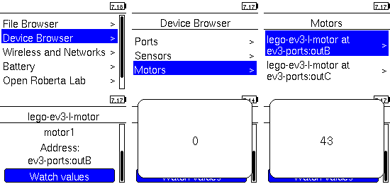
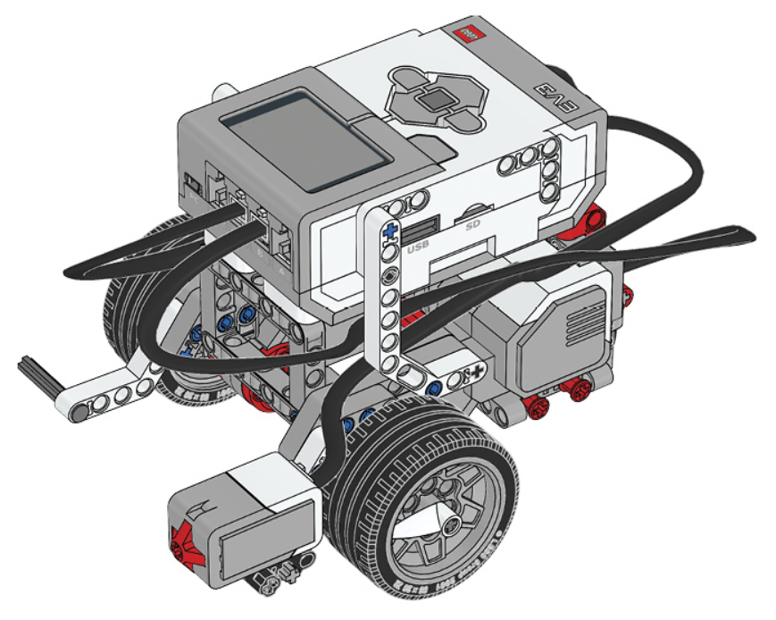

# Presnejší pohyb a dotykový senzor

V minulej lekcii sme sa naučili ako spustiť motor: `#!py motor.run( speed )`.
To ale nemusí byť vždy najlepší spôsob ako posunúť robota. Skúsme si na robotovi
spustiť nasledujúci jednoduchý program:

```py linenums="1"
from pybricks.ev3devices import Motor
from pybricks.parameters import Port
from pybricks.tools import wait

motor = Motor( Port.B )

motor.run( 360 )
wait( 2000 )
motor.stop()
```

Keď zastavíme alebo len spomalíme točiace sa koleso, jednoducho sa otočí o toľko
menej. Podobne, ak bude na zemi nejaká prekážka, či len iný povrch, môže
sa robot správať inak a posunúť sa o menej či viac než keď sme naposledy náš
program skúšali. Čo sa s tým dá robiť?

## Presnejší pohyb

Ukážeme si novú dôležitú metódu `motor.run_angle`:

```py linenums="1"
from pybricks.ev3devices import Motor
from pybricks.parameters import Port
from pybricks.tools import wait

motor = Motor( Port.B )

motor.run_angle( 360, 2 * 360 )
```

"angle" znamená po anglicky "uhol", takto vieme pootočiť motor presne o určený
uhol. Prvý parameter je rýchlosť, znovu v stupňoch za sekundu. Druhý parameter
je uhol v stupňoch, o ktorý sa motor pootočí. Keďže kruh má 360 stupňov, motor
sa otočí o dve celé rotácie. Aj ak skúsime koleso na robotovi zachytiť, po jeho
pustení sa dotočí tak, aby nakoniec tie dve rotácie vykonalo.

!!! note "Poznámka"
    Všimnime si, že už nemusíme volať `#!py motor.stop()`. Motor po dosiahnutí
    svojho cieľa zastaví.

To je pre nás dobrá správa, že takéto metóda triedy `Motor` existuje. Poďme
ju využiť a posunúť sa s celým robotom vpred, nie len jednou stranou.

```py linenums="5"
left_motor = Motor( Port.B )
right_motor = Motor( Port.C )

left_motor.run_angle( 360, 2 * 360 )
right_motor.run_angle( 360, 2 * 360 )
```

A nastal problém. Takto sa robot neposunie vpred rovno, ale najprv jedným
kolesom, potom druhým. Je to preto, že `run_angle` má ešte ďalší, prednastavený
(*default*) parameter: `wait`. Ak ho neuvedieme medzi argumentami pri volaní
metódy, je nastavený na `#!py True`, čo znamená, že robot čaká, pokým sa tento
príkaz pootočenia motora nevykoná do konca. Keď ho nastavíme na `#!py False`,
čakať nebude, ale hneď bude pokračovať nasledujúcim riadkom, teda spustí oba
motory (skoro, no je to zanedbateľný rozdiel v čase) naraz. Koniec nášho
programu teraz vyzerá:

```py linenums="8"
left_motor.run_angle( 360, 2 * 360, wait=False )
right_motor.run_angle( 360, 2 * 360)
```

Program už funguje ako má, hurá! Pri `right_motor` sme už nenastavili `wait`
na `#!py False`, lebo naopak chceme počkať, pokým sa tento motor dotočí.
Predpokladáme, že vtedy už aj `left_motor` je na správnej pozícii, keď sa majú
otočiť oba tou istou rýchlosťou o ten istý úsek.

??? note "Naozaj presný pohyb"
    Toto je už trochu pokročilejšie. No môže sa stať, že `left_motor` ešte
    nebude dotočený (napr. ho blokuje nejaká prekážka). Preto je lepšie počkať,
    pokým kontrolér riadiaci tento motor nebude hlásiť, že je už všetko
    v poriadku. To vieme zistiť cez `#!py motor.control.done()`. Dobré je si
    pripraviť takúto pomocnú funkciu na začiatku programu, ktorú je možné ďalej
    využívať a nepísať zakaždým v programe celý kód znovu:

    ```py linenums="1"
    def move_angle( speed, rotation_angle ):
        left_motor.run_angle( speed, rotation_angle, wait=False )
        right_motor.run_angle( speed, rotation_angle, wait=True )

        while not left_motor.control.done():
            wait(1)
    ```

??? note "Ďalší prednastavený parameter"
    V skutočnosti má `run_angle` ešte jeden *default* parameter: `then`.
    Určuje, akým spôsobom motor na konci zastaví. Sú tri možnosti:

    - `#!py Stop.COAST` plynule nechá motor dôjsť zotrvačnosťou.
    - `#!py Stop.BRAKE` zastaví motor hneď.
    - `#!py Stop.HOLD` udržuje motor v konečnej pozícii. To znamená, že ak by
       niečo pootočilo koleso, robot sa bude snažiť vrátiť ho do pôvodnej
       pozície.

    Prednastavená hodnota je `#!py then=Stop.HOLD`.

???+ question "Jednoduchá úloha"
    Skúste upraviť program tak, aby sa robot raz otočil na mieste a skončil
    (čo najviac) presne tak ako na začiatku.

???+ tip "Meranie otočenia motora"
    V tejto úlohe vám pomôže otočiť motory manuálne o toľko, koľko
    potrebujete, aby sa celý robot otočil o celú otáčku, a pritom si nechať
    vypisovať na displeji počet stupňov otočenia motora:
    

???+ question "Ťažšia úloha"
    Napíšte program, ktorým robot pôjde do tvaru štvorca. Využite informáciu
    z predchádzajúcej úlohy, kde ste už zistili ako sa otočiť o celú rotáciu,
    teraz potrebujete len o štvrť rotácie. Používajte vždy metódy
    `run_angle`.

???+ question "Úloha na zamyslenie"
    Možno ste na minulú úlohu použili veľa zavolaní `run_angle`. Ak áno, skúste
    svoj program skrátiť použitím `#!py for ... in ...` cyklu a/alebo
    zadefinovaním si svojej pomocnej funkcie.

??? example "Riešenie"
    Ukážeme si ako napríklad by sa dala úloha vyriešiť:

    ```py linenums="1"
    from pybricks.ev3devices import Motor
    from pybricks.parameters import Port
    from pybricks.tools import wait

    left_motor = Motor( Port.B )
    right_motor = Motor( Port.A )

    def move_angle( speed, angle, rotate=False ):
        left_motor.run_angle( speed, angle, wait=False )
        if rotate:
            angle = -angle
        right_motor.run_angle( speed, angle, wait=True )

    for _ in range( 4 ):
        move_angle( 360, 2 * 360 )
        move_angle( 360, 150, rotate=True )
    ```

    Štvorec sme rozdelili na štyri rovnaké úseky: najprv sa robot pohne dopredu
    a potom sa otočí o 90°. V kóde vidíme dve nové veci:

    - Definícia vlastnej funkcie s *default* parametrami. Píšeme ich vždy
      na koniec a pomocou znaku ++equal++ prednastavíme hodnotu.
    - `#!py for _ in range( 4 ):` Namiesto `_` by sme rovnako mohli napísať
      napr. `i`, ako sme zvyknutí, ale ak túto premennú vnútri cyklu nevyužijeme
      (čo je tento prípad), tak je zvykom nazvať ju jednoducho `_`.

## Dotykový senzor

Na robota teraz pridáme dotykový senzor. Tak bude dostávať aj spätnú väzbu
z okolia, čo je pre robotov veľmi dôležité. Podľa toho môže zmeniť správanie.
Napr. pri narazení do steny dotykovým senzorom, robot náraz detekuje, otočí sa
a bude hľadať cestu iným smerom. Návod je [tu](https://education.lego.com/v3/assets/blt293eea581807678a/blt95682a19090a6923/5f8801e2ad20281d51fbc1cc/ev3-touch-sensor-driving-base.pdf).



V návode ste si určite všimli, že kábel od dotykového senzoru je zapojený
na druhej strane ako káble od motorov. Zariadenia, ktoré pripájame
k EV3-kocke, môžeme rozdeliť na dva typy:

1. *vstupné* -- To sú senzory. Ich porty sú označené číslami 1 - 4. Senzory
   snímajú rôzne hodnoty z okolia (napr. teplotu, vzdialenosť od objektu vpredu,
   intenzitu svetla, dotyk, ...) a posielajú ich do EV3-kocky, ktorá následne
   hodnoty spracuje a robot zmení podľa toho správanie. Je to našou úlohou,
   programátorov, zvoliť tie správne reakcie na hodnoty z okolia.
2. *výstupné* -- Cez ne robot mení správanie. Napr. pohybom pomocou motorov.
   Alebo začne blikať svetelnými diódami, vykreslí niečo na displeji, či vydá
   zvuky, môže dokonca napodobniť ľudskú reč.

## Ako pracovať s dotykovým senzorom v Pythone

Balíček `pybricks` ponúka modul `ev3devices`, kde sa okrem triedy `Motor`
nachádza aj trieda `TouchSensor`. Na jeho objektoch zavoláme metódu `pressed`,
ktorá vráti hodnotu `#!py True` alebo `#!py False` podľa toho, či je spínač
stlačený.

!!! example "Príklad"
    Poďme si to vyskúšať na jednoduchom príklade. Stlačením senzoru budeme
    posúvať robota vpred, keď senzor stlačený nebude, robot zostane stáť.

    ```py linenums="1"
    from pybricks.ev3devices import Motor, TouchSensor
    from pybricks.parameters import Port
    from pybricks.tools import wait

    left_motor = Motor( Port.B )
    right_motor = Motor( Port.C )
    touch_sensor = TouchSensor( Port.S1 )

    def move( speed ):
        left_motor.run( speed )
        right_motor.run( speed )

    while True:
        if touch_sensor.pressed():
            move( 360 )
        else:
            move( 0 )
    ```

    `#!py while True:` vytvorí nekonečný cyklus, v ktorom sa zakaždým spýtame
    dotykového senzoru, či je stlačený, a podľa toho určíme motorom rýchlosť.
    Tu je ďalší spôsob ako zastaviť motory -- nastaviť im rýchlosť na nulu.

???+ question "Úloha 1"
    Upravte program pohybu robota do štvorca tak, aby na začiatku robot stál
    na mieste a čakal na stlačenie tlačidla. Potom prejde štvorec, znovu čaká
    na mieste na stlačenie tlačidla, a tak stále dokola.

???+ question "Úloha 2"
    Napíšte program, kde robot pôjde pomaly rovno dopredu, pokým nenarazí
    do prekážky dotykovým senzorom. Vtedy zastane, trochu cúvne, otočí sa
    (približne) o 90° a pôjde znovu pred až pokým nenarazí opäť. Toto správanie
    sa bude opakovať donekonečna.

???+ question "Úloha 3"
    Teraz využijete program z predchádzajúcej úlohy, len sa zmení prostredie.
    Postavte robota na stôl a upravte ho tak, aby bol dotykový senzor otočený
    smerom k zemi a dotýkal sa jej tak, že je stlačený. Ak robot príde na okraj
    stola, namiesto narazenia do prekážky ako v minulej úlohe, dotykový senzor
    sa už nebude opierať o stôl a tlačidlo sa uvoľní. Vtedy robot vykoná rovnaký
    manéver ako v minulej úlohe. Budete teda potrebovať aj program mierne
    upraviť. Pri testovaní pozor! Nech robot nespadne zo stola, aj pri dobre
    napísanom programe sa to môže stať.
    trochu upraviť program.
