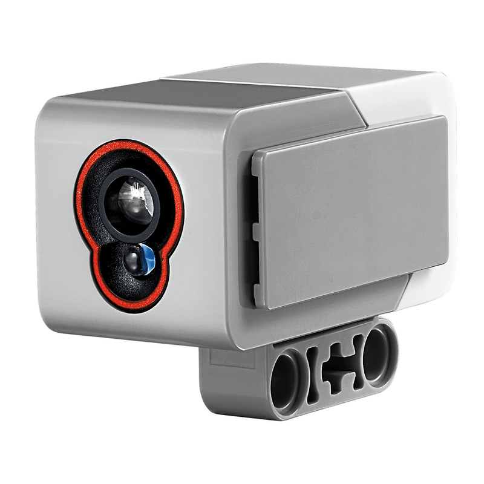

# Svetelný senzor

Dnes si ukážeme ďalší senzor, pomocou ktorého budeme vedieť rozlišovať farby
predmetov a zisťovať intenzitu svetla. Aby sme si ho prakticky vyskúšali,
vymeníme dotykový senzor z minulej lekcie za svetelný senzor (opäť zapojený
v porte číslo 1), ktorý bude otočený
smerom do zeme a umiestnený na prednej strane robota v strede, asi 1.5 cm
od zeme (spodná časť senzoru). Tentokrát to skúste bez návodu :)

{ style="width:30%;height:auto" }

## Ako funguje svetelný senzor?

Tento senzor má v sebe tri svetelné diódy: červenú, zelenú a modrú. Sú to tri
základné farby v počítačovej grafike, ktorých miešaním vieme vytvoriť ostatné
farby. A senzor tiež obsahuje svetelný prijímač, ktorý zistí intenzitu
dopadajúceho svetla. Ak chceme rozlíšiť farbu predmetu pred senzorom, krátko
sa rozsvieti každá z troch svetelných diód a zmeria sa odrazené svetlo. Tieto
hodnoty sa potom dajú dokopy a senzor výsledok vyhodnotí ako jednu zo
7 farieb: čierna, modrá, zelená, žltá, červená, biela a hnedá. Alebo "žiadna"
farba, ak napr. pred senzorom žiaden objekt v blízkosti nie je, len vzduch.

## Ako svetelný senzor použijeme v programe?

V moduli `ev3devices` existuje trieda `ColorSensor`. Na objektoch tejto triedy
budeme volať metódy:

- `color`: vráti farbu objektu `Color.BLACK`, `Color.BLUE`, ..., alebo `None`
  pre žiadnu farbu (`Color` pochádza z modulu `parameters`).
- `ambient`: vráti intenzitu (číslo medzi 0 a 100) svetla z okolia.
- `reflection`: ako `ambient`, ale pre odrazené svetlo, to znamená, že senzor
  krátko zasvieti a zmeria intentzitu až potom.
- `rgb`: vráti intenzitu každej zložky svetla, červenej (*r*ed), zelenej
  (*g*reen) a modrej (*b*lue) ako *n-ticu* (*tuple*).

???+ note "*tuple*"
    *tuple* je nový dátový tip, s ktorým sme sa ešte nestretli. Je podobný
    zoznamu, až na to, že sa nedá meniť. Namiesto hranatých zátvoriek sa
    zapisuje pomocou okrúhlych. Je užitočný ak viacero hodnôt patrí úzko
    ku sebe.
    ```py
    >>> t = (1, 2, 5)
    >>> t
    (1, 2, 5)
    >>> t[0]
    1
    >>> t[0] = 3
    Traceback (most recent call last):
      File "<stdin>", line 1, in <module>
    TypeError: 'tuple' object does not support item assignment
    >>> t += (3, 4) # "t" sa nezmení, ale vznikne nový objekt a pomenuje sa "t"
    >>> t
    (1, 2, 5, 3, 4)
    ```

!!! example "Príklad"
    Naprogramujeme si robota tak, aby chodil po čiernej čiare. Predstavme si,
    že všade okolo je biela zem a len jedna kľukatá čierna čiara, hrubá asi
    1.5 cm. Ak robota postavíme na začiatok čiary tak, aby svetelný senzor
    snímal pravý okraj čiary a pustíme ho rovno vpred, bude sa môcť riadiť ďalej
    týmito pravidlami:

    1. Nasníma nižšiu intenzitu svetla -- to znamená, že je na zákrute vpravo,
       senzor sa dostal z okraju čiary viac do stredu a preto "vidí" viac
       čiernej farby (teda menej intenzity svetla).
    2. Naopak, keď nasníma vyššiu intenzitu sveta, tak čiara musí byť naľavo,
       robot sa dostal od čiary preč, na bielu plochu okolo.

    Poďla toho sa pootočí na stranu, kde pokračuje čiara.

    ```py linenums="1"
    from pybricks.ev3devices import Motor, ColorSensor
    from pybricks.parameters import Port
    from pybricks.tools import wait

    left_motor = Motor( Port.B )
    right_motor = Motor( Port.A )
    color_sensor = ColorSensor( Port.S1 )

    def move( speed_left, speed_right ):
        left_motor.run( speed_left )
        right_motor.run( speed_right )

    WHITE = 60
    BLACK = 40

    while True:
        intensity = color_sensor.reflection()

        if intensity > WHITE:
            move( -180, 180 )
        elif intensity < BLACK:
            move( 180, -180 )
        else:
            move( 360, 360 )
    ```

    Číselné hodnoty v kóde sú závislé na konkrétnom prostredí, kde púšťame
    robota. Je vhodné si najprv zistiť, akú intenzitu svetla robot vníma
    na bielej a čiernej čiare a podľa toho nastaviť `WHITE` a `BLACK` tak, aby
    `WHITE` bola hodnota, keď sa robot dostane kúsok mimo čiary, a `BLACK`
    keď sa robot (svetelný senzor na ňom) dostane príliš dovnútra čiernej
    čiary. Nastaviť dobré hodnoty môže chvíľu trvať.

???+ question "Úloha 1"
    Pripravte si dráhu, na ktorej budete robota chodiaceho po čiare testovať.
    Mohli by stačiť veľké biele papere a čierna elektroizolačná páska.
    Nastavte hodnoty v programe tak, aby robot zvládol po čiare prejsť.

???+ tip "Meranie hodnôt senzorov"
    Podobne ako sme v minulej lekcii merali otočenie motora, vieme teraz
    zmerať hodnoty, ktoré vráti metóda `#!py color_sensor.reflection`:

    

    Ak nastavený mód nie je `COL-REFLECT`, zvolíme `Set mode`:

    

???+ question "Úloha 2"
    Upravte program tak, aby robot mohol začínať na ľavej a nie pravej strane
    čiary. Teda nebude sledovať pravý okraj, ale ľavý.

???+ question "Úloha 3"
    Toto je ťažká úloha. Ale dá sa vyriešiť a človekovi uľahčí prácu --
    automatické nastavenie hodnôt `BLACK` a `WHITE`. Robota bude stačiť
    na začiatku postaviť na čiaru, otočeného tak, aby svetelný senzor bol
    nad bielou plochou. Robot nasníma hodnotu bielej farby a pomaly sa bude
    otáčať na mieste a sledovať stále intenzitu svetla. Keď nadíde na čiernu
    čiaru, intenzita sa zníži, robot si zapamätá jej minimum, lebo potom
    sa znovu začne zvyšovať, robot prejde cez stred čiary a otáča sa ďalej.
    Pomocou týchto dvoch hodnôt sa potom určia hodnoty `BLACK` a `WHITE`.
    (Vlastne, už by sme ich nemali písať veľkými písmenami, lebo to nebudú
    konštanty.) Ale pozor, nemôžeme ich jednoducho nastaviť na práve tú nameranú
    hodnotu, to by nefungovalo (prečo?).

??? example "Riešenie úlohy 3"
    ```py linenums="1"
    from pybricks.ev3devices import Motor, ColorSensor
    from pybricks.parameters import Port
    from pybricks.tools import wait

    left_motor = Motor( Port.B )
    right_motor = Motor( Port.A )
    color_sensor = ColorSensor( Port.S1 )

    def move( speed_left, speed_right ):
        left_motor.run( speed_left )
        right_motor.run( speed_right )

    white = color_sensor.reflection()

    move( -90, 90 )
    last_intensity = color_sensor.reflection()
    decreasing = True
    while decreasing:
        new_intensity = color_sensor.reflection()
        if new_intensity > last_intensity:
            decreasing = False
        last_intensity = new_intensity
    move( 0, 0 )

    black = color_sensor.reflection()

    while True:
        intensity = color_sensor.reflection()

        if intensity > white:
            move( -180, 180 )
        elif intensity < black:
            move( 180, -180 )
        else:
            move( 360, 360 )
    ```
    V tomto programe sa robot začne otáčať vľavo a v každom opakovaní `while`
    cyklu načíta intenzitu odrazeného svetla. Ak je už vyššia ako tá
    predošlá, znamená to, že je niekde blízko stredu čiary, kúsok za stredom,
    a vtedy zastaví.

## Červená, stáť!

Ako sme už hovorili, svetelný senzor dokáže viac než len odmerať intenzitu
dopadajúceho svetla. Vie odlíšiť aj niekoľko bežných farieb. My si teraz
vylepšíme našeho robota, aby zastavil na červenej značke. Len upravíme náš
už existujúci program -- jeho nekonečný `while` cyklus:

```py linenums="16"
while True:
    if color_sensor.color() == Color.RED
        break

    intensity = color_sensor.reflection()

    if intensity > white:
        move( -180, 180 )
    elif intensity < black:
        move( 180, -180 )
    else:
        move( 360, 360 )

move( 0, 0 )
```

Hneď na začiatku každého opakovania robot vyskúša, či nabehol na červenú značku,
ak áno, cez `break` "vyskočí" von z nekonečného cyklu a pokračuje za ním, teda
na riadku s `#!py move( 0, 0 )`. Ešte potrebujeme naimportovať triedu `Color`,
ktorú sme doteraz nevyužívali:

```py linenums="2"
from pybricks.parameters import Port, Color
```

Vyskúšajte, či program funguje :)

???+ question "Úloha 1"
    Použite ďalšiu značku, napr. modrú, na ktorú keď robot nadíde, otočí sa
    na mieste a bude pokračovať po čiare naspäť, z kade prišiel.

???+ question "Úloha 2"
    Upravte svoju trénovaciu plochu s čiarou tak, aby na niektorých miestach
    bola čiara prerušená. Pridajte robotovi aj druhý svetelný senzor,
    tentokrát si bude udržovať čiernu čiaru medzi dvomi senzormi. Nedávajte ich
    teda od seba veľmi ďaleko. Výhoda použitia dvoch senzorov je, že robot
    dokáže sledovať cestu aj s vynechanými úsekmi čiary. Logiku programu budete
    musieť ale úplne zmeniť.
